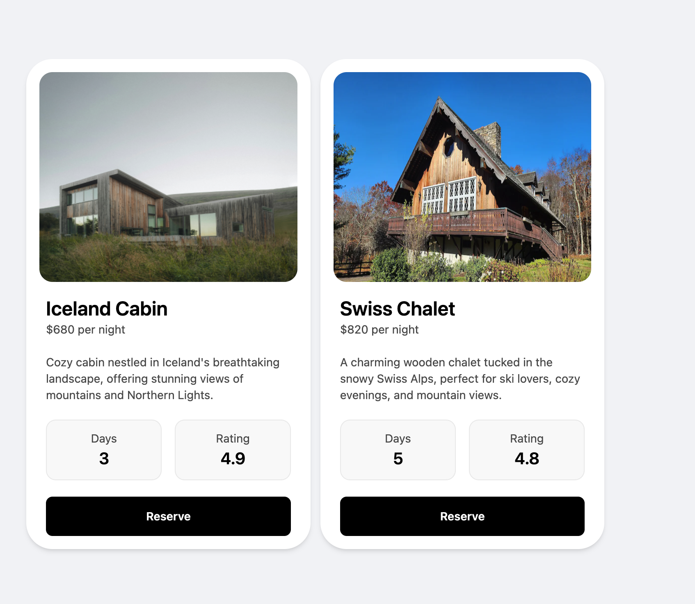

# Figma to React: Card UI Component

This project is a responsive, accessible, and reusable card UI built with React and Tailwind CSS, based on a Figma design.

## 🔗 Live Demo

[View on Netlify](https://your-netlify-link.netlify.app)

## 🧰 Tech Stack

- React
- Tailwind CSS
- Accessibility (ARIA, keyboard nav, semantic HTML)
- JSON-driven component structure

## 📦 Features

- Responsive grid layout
- Card components built from a Figma source
- Line-clamped description
- Focus and hover interactivity
- Dynamically mapped via JSON array

## 🎨 Design Reference

[Figma File](https://www.figma.com/design/W3FK7JW28zIrb09HnGiMWE/Modern---Clean-UI-Cards.--Community-?node-id=14-47&t=goYUXbj3Vi3B4Tdl-0)

## 📸 Screenshot

## 📁 Folder Structure

    src/
    ├── assets/
    │ ├── fonts/
    | └── images/
    ├── components/
    │ └── Card.jsx
    ├── data/
    │ └── cards.js
    ├── App.jsx
    ├── index.css
    └── main.jsx

## 📝 License

MIT
